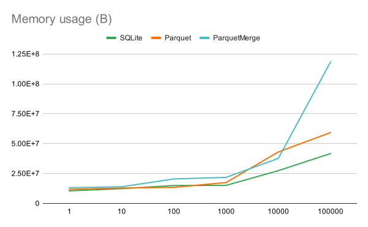

# Performance
This is a document outlining the current performance of a number of result listeners provided by OpenTAP.

Last update: 17/03/2025

The goal of this is to help the user select the right result listener for their needs, aswell as showing off how fast and compact the parquet result listener is.

The primary point of comparison is between this Parquet result listener and the SQLite result listener. The CSV and Spreadsheet result liteners have mostly been included out of curiosity, as they serve completely different purposes. Generally it can be said that CSV and Spreadsheet are designed for human readable data, in smaller amounts. However for bigger amounts of data some form of binary serialization is necessary. This is where SQLite and Parquet comes in. They can serialize large results a lot quicker, and they can compress the data a lot more aswell.

## Setup
This section will outline how to set up the benchmarking environment so the tests should be repeatable by anyone else.

### Result listeners
If a setting is not explicitly mentioned below, then that setting has not been modified from the default. All result listeners were present at all times, but only the result listeners listed for each result were active.

#### CSV
*Result Listener*: `Text/CSV`

*Settings*: `Default`

#### Spreadsheet
*Result Listener*: `Database/Spreadsheet`

*Settings*: `Open file` -> `false`

#### SQLite
*Result Listener*: `Database/SQLite`

*Settings*: `File Path` -> `Results/SqliteDatabase.TapResults`

#### Parquet
*Result Listener*: `Database/Parquet`

*Settings*: `Default`

#### ParquetMerge
*Result Listener*: `Database/Parquet`

*Settings*: `File path` -> `Results/<TestPlanName>.parquet`

#### MemoryLogger
Source code found [here](MemoryLogger.cs)

The purpose of this is to log max memory usage, aswell as total runtime (including closing of other result listeners).

### Plugins
All plugins were installed at all times, even when they were not used.

|Name|Version|Creator|
|-|-|-|
|CSV|9.13.0|Keysight Technologies, Inc.|
|Demonstration|9.0.7|Keysight Technologies, Inc.|
|Editor|9.27.1|Keysight Technologies, Inc.|
|Keysight Licensing|1.5.1|Keysight Technologies, Inc.|
|OpenTAP|9.27.1|OpenTAP|
|OsIntegration|1.4.3|Keysight Technologies, Inc.|
|Parquet|1.0.0 (Unreleased)|OpenTAP|
|PathWave License Manager|7.4.1||
|Spreadsheet|2.1.0|OpenTAP|
|SQLite and PostgreSQL|9.6.0|Keysight Technologies|
|WPF Controls|9.27.1|Keysight Technologies, Inc.|

### Computer specs
HP EliteBook 840 14 inch G9 Notebook PC

Processor	12th Gen Intel(R) Core(TM) i5-1245U   1.60 GHz

Installed RAM	16,0 GB (15,6 GB usable)

System type	64-bit operating system, x64-based processor

Edition	Windows 10 Enterprise 19045.5487

### Testplan/Running
A simple test plan was made for the benchmarks. It consists of two steps that mostly have default settings.

```
Repeat
    Sine Result
```

#### Repeat

`Count` has been parameterized on the test plan. Will henceforth be refered to as `Repeat Count`

#### Sine Result
`Results/Point Count` has been parameterized on the test plan. Will henceforth be refered to as `Sine Count`
`Results/Noise Enabled` -> `True`

## Running the benchmarks
All generated results were deleted between each run to avoid overwriting/merging behaviour in different result listeners. A script was also made to quickly run the benchmarks one after the other directly from the terminal. The used commands can be seen in the [results file](Results.csv). Each run of this command ran all tests with the same parameters with 1 second of delay between them (to allow the CPU to idle a bit).

## Results
All the raw results can be seen in [Results](Results.csv) but they will also be presented here.

### Table

|Result Listener|Repeat Count|Sine Count|Runtime|Max memory usage|File size|
|-|-|-|-|-|-|
|              |0      |1000   |52ms       |9.3MB       |0B|
|              |1      |1000   |112ms      |9.3MB       |0B|
|              |10     |1000   |105ms      |9.7MB       |0B|
|              |100    |1000   |333ms      |12.8MB      |0B|
|              |1000   |1000   |423ms      |15.8MB      |0B|
|              |10000  |1000   |2.47s      |20.6MB      |0B|
|              |100000 |1000   |23.8s      |23.4MB      |0B|
|CSV           |0      |1000   |71ms       |9.4MB       |0B|
|CSV           |1      |1000   |116ms      |10.9MB      |65.8KB|
|CSV           |10     |1000   |254ms      |12.7MB      |657KB|
|CSV           |100    |1000   |2.18s      |14.2MB      |6.5MB|
|CSV           |1000   |1000   |18.7s      |28.1MB      |65.6MB|
|CSV           |10000  |1000   |183s       |39.1MB      |656MB|
|CSV           |100000 |1000   |DNF        |DNF         |DNF|
|Spreadsheet   |0      |1000   |430ms      |11.8MB      |2.56KB|
|Spreadsheet   |1      |1000   |598ms      |19.9MB      |77.5KB|
|Spreadsheet   |10     |1000   |1.64s      |128MB       |742KB|
|Spreadsheet   |100    |1000   |18.0s      |1.16GB      |7.40MB|
|Spreadsheet   |1000   |1000   |429s       |1.11GB      |74.3MB|
|Spreadsheet   |10000  |1000   |DNF        |DNF         |DNF|
|Spreadsheet   |100000 |1000   |DNF        |DNF         |DNF|
|SQLite        |0      |1000   |245ms      |10.5MB      |86.0KB|
|SQLite        |1      |1000   |269ms      |12.3MB      |118KB|
|SQLite        |10     |1000   |328ms      |14.9MB      |434KB|
|SQLite        |100    |1000   |957ms      |15.1MB      |3.60MB|
|SQLite        |1000   |1000   |5.36s      |27.4MB      |36.2MB|
|SQLite        |10000  |1000   |69.2s      |41.7MB      |372MB|
|SQLite        |100000 |1000   |1242.2s    |45.4MB      |3.82GB|
|Parquet       |0      |1000   |275ms      |11.7MB      |7.68KB|
|Parquet       |1      |1000   |338ms      |12.8MB      |20.8KB|
|Parquet       |10     |1000   |355ms      |13.4MB      |107KB|
|Parquet       |100    |1000   |637ms      |17.4MB      |974MB|
|Parquet       |1000   |1000   |3.22s      |43.0MB      |9.65MB|
|Parquet       |10000  |1000   |28.7s      |59.3MB      |96.4MB|
|Parquet       |100000 |1000   |286s       |385MB       |964MB|
|ParquetMerge  |0      |1000   |341ms      |13.1MB      |7.68KB|
|ParquetMerge  |1      |1000   |423ms      |13.9MB      |18.8KB|
|ParquetMerge  |10     |1000   |536ms      |20.5MB      |113KB|
|ParquetMerge  |100    |1000   |1.15s      |21.7MB      |998KB|
|ParquetMerge  |1000   |1000   |6.14s      |37.6MB      |9.85MB|
|ParquetMerge  |10000  |1000   |56.4s      |118MB       |98.4MB|
|ParquetMerge  |100000 |1000   |583s       |554MB       |984MB|

> Note: The `Memory` result listener was always enabled, and is therefore not mentioned.

> Note: DNF means the result listener was taking too long to complete on previous runs, so it wasn't run on those parameters.

### Graphs
#### All result listeners


As can be seen on the graphs above, CSV and Spreadsheet consistently perform the worst. They were not run all the way up to 100k points, because running them at that amount of data would take way to long.

#### Large data result listeners




Its time to take a closer look at SQLite and Parquet. ParquetMerge is what happens when the `<ResultType>` macro is not part of the path, meaning all the data has to be merged at the end of the run. Interestingly even when merging the data into one file Parquet is still faster than SQLite.

For memory usage Parquet is consistently a bit above SQLite, this is probably because the result listener has to save the data untill after the steps are done running. So there is a bit of caching going on. The memory usage for ParquetMerge is likely higher because of the merging post-processing where two very large files have to be merged together.

At the end the file-size between Parquet and ParquetMerge is almost the same. There is a slight edge to ParquetMerge, so interestingly there might be atleast one benefit to merging the files together. SQLite files are bigger than Parquet files, however it seems like the growth of SQLite files is quite a bit bigger than Parquet files.


## Conclusions
In the end, if you want data in a human readable format there is not really any getting around it. You need CSV or Spreadsheet or something similar. But if you want speed you can use Parquet, which also produces the smallest file sizes. The only place where you should consider using SQLite therefore seems to be when you have limited memory. But even then Parquet does not use a lot more memory than SQLite.